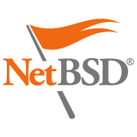

## Compile & install Capstone

There are several methods to compile and install Capstone. You can view a detailed tutorial for windows and linux [here](http://s4.ce.sharif.edu/blog/2019/01/17/capstone/).

### 1. From source code

Find the source in [Download](download.html) section and follow the instructions in the *README* file.

The issue with this approach is that at the moment, Windows targets are only possible via Cygwin/MingW cross-compilation. We are working to support Microsoft Visual Studio in the next versions.

---

### 2. From repositories       

This section explains how to install Capstone on \*nix platforms from some software repositories.

- Firstly, install the essential *core engine*, no matter what you are going to do. Section 2.1 ~ 2.5 provide instructions for Mac OSX, FreeBSD, OpenBSD & NetBSD.

- Next, if you code in Python, install the Python binding. Section *2.4* applies for all \*nix platforms, ranging from OSX, iOS, Android, Linux, \*BSD to Solaris.

- For bindings of other languages - either C#, C++, Go, Java, Javascript, Lua, Ocaml, Ruby or Vala - see [Download](download.html).

#### 2.1 Debian/Ubuntu Linux - core engine  

`NOTE`: At the moment only version *2.1.2* is available in Ubuntu/Debian repositories. Version *3.0.4* will be provided later.

Capstone is available in Ubuntu & Debian Linux (testing/sid flavours). Binary package of the core of Capstone can be installed with:


  $ sudo apt-get install libcapstone2


To write your own tools with Capstone, install the development package with:


  $ sudo apt-get install libcapstone-dev


#### 2.2 Mac OSX - core engine  

- **Macport** users can install the core of Capstone with:


  $ sudo port install capstone


  Note that Macport installs libraries into its own directory, so you need to tell applications where to find them, for example with:


  $ export DYLD_LIBRARY_PATH=/opt/local/lib/:$DYLD_LIBRARY_PATH


- **Homebrew** users can install the core of Capstone with:


  $ brew install capstone


  Note that Homebrew installs libraries into its own directory, so you need to tell applications where to find them, for example with:


  $ export DYLD_LIBRARY_PATH=/usr/local/opt/capstone/lib/:$DYLD_LIBRARY_PATH


#### 2.3 FreeBSD - core engine  

`NOTE`: At the moment only version *2.1.2* is available in FreeBSD. Version *3.0.4* will be provided later.

Binary package of the core of Capstone can be installed with:


  # pkg install capstone


Or you can also compile & install from source with:


  # cd /usr/ports/devel/capstone; make install


#### 2.4 OpenBSD - core engine  

`NOTE`: At the moment version *3.0* is available in OpenBSD. Version *3.0.4* is only provided in *OpenBSD-current* branch.

Capstone is available in OpenBSD from version *5.5*. Binary package of the core of Capstone can be installed with:


  $ sudo pkg_add capstone


Or you can also compile & install from source with:


  $ cd /usr/ports/devel/capstone; sudo make install


#### 2.5 NetBSD - core engine  

Binary package of the core of Capstone can be installed with:


  $ sudo pkg_add capstone


#### 2.6 Python binding  

There are several ways to install Python binding.

##### 2.6.1 Install from source code

The Python binding depends on *the core*, so make sure to *install the core before* you can use this binding.

On \*nix platforms, do:

$ cd bindings/python
$ sudo make install


On Windows, do:

cd bindings/python
python setup.py install


##### 2.6.2 Install from PyPi package

Our [PyPi](https://pypi.python.org/pypi/capstone) package include the source code of the core inside, and it will automatically build and install the core library into the same directory with Python module, so if you install from PyPi, there is no need to install the core beforehand.

On \*nix platforms (confirmed on Mac OSX, iOS, Android, Linux, \*BSD & Solaris), Python binding can be installed using *pip*, as follows.


  $ sudo pip install capstone


On Windows, you need to install [CMake](http://cmake.org) and *Microsoft Visual Studio* in order to compile the core. Run the following command from *Visual Studio developer commandline prompt*


  $ pip install capstone


Alternatively, download [PyPi package](https://pypi.python.org/packages/source/c/capstone/capstone-3.0.4.tar.gz), unzip it, then run the following command from *Visual Studio developer commandline prompt*.


  python setup.py install


##### 2.6.3 Install from PyPi package - for Windows only

Method above (2.6.2) requires *CMake* and *Visual Studio* to compile the core on Windows. In case you cannot or do not want to compile code, use another [PyPi capstone-windows](https://pypi.python.org/pypi/capstone-windows) package which already has the core *prebuilt* inside.

On Windows, run the following command from *Commandline prompt*


  $ pip install capstone-windows


Alternatively, download [PyPi package](https://pypi.python.org/packages/source/c/capstone-windows/capstone-windows-3.0.4.tar.gz), unzip it, then run the following command from *Commandline prompt*.


  python setup.py install


---

### 3. Precompiled binaries     

At the moment precompiled binaries for *Windows*, *Ubuntu*, *FedoraCore*, *Python binding* & *Java* are available in our [Download](download.html) section.

- **Windows** 

  If you only want to write your tool in Python, all you need is the *Python installer*, which includes full Capstone module. The Windows core engine is *not necessary* because it is *already embedded inside* the Python module.

  For any other bindings, firstly you still need to install the Windows core engine, which includes the static/dynamic libraries and also the headers (\*.h) for C programming.

- **Java** 

  Java binding is availabe in JAR package in [Download](download.html).

---

## Programming

After installation, find in tutorials below how to write your reverse & analysis tools based on Capstone using your favorite programming languages.

- [Programming with C language](lang_c.html).

- [Programming with Python language](lang_python.html).

- [Programming with Java language](lang_java.html).

- [Retrieve access information of instruction operands](op_access.html).

- [Customize instruction mnemonics at run-time](mnemonic.html).

---

## Miscellaneous

This section introduces several ways to customize Capstone engine at compile time & clarify the features of our framework.

- [Capstone: next generation disassembly framework](/BHUSA2014-capstone.pdf)

  This Blackhat USA 2014 slides (PDF) describes technical details of Capstone.

- [Build a compact engine with only selected architectures](compile.html)

  This documentation explains how to build a more compact engine with only selected architectures. A smaller library is useful when we want to embed Capstone in special environments such as firmware or OS kernel driver.

- [Build "diet" engine to further slim down its size](diet.html)

  To make an even smaller engine, version 2.1 presents a *diet* mode, in which non-critical data is removed. Combined with the method of building only selected architectures above, Capstone binary size can be reduced up to 50% in some cases, make it easier than ever for embedding purpose.

- [Build embedded engine for firmware/OS kernel](embed.html)

  Embedding Capstone requires a special engine, built by special methods. This documentation introduces necessary steps to compile the engine & program your code towards this target.

- [Build X86-reduce engine for firmware/OS kernel](x86reduce.html)

  This introduces the compile-time option named *X86-reduce* to make X86 engine of Capstone to be *~60% smaller*, to just *around 100KB*.

- [SKIPDATA mode](skipdata.html)

  This introduces the *SKIPDATA* mode to let Capstone keeps disassembling even when it encounters broken instruction, which is most likely data mixed inside the input.

- [Iteration disassembling](iteration.html)

  This explains how to use the API *cs_disasm_iter* to quickly iterates all the instructions in the input buffer using a memory cache provided by user.

- [Beyond LLVM](beyond_llvm.html)

  A part of Capstone is built with LLVM code. However, Capstone is not just LLVM, but superior because it is designed & implemented towards disassembling for security purpose.
  
- [A Micro Capstone-Engine API Documentation in Chinese](https://github.com/kabeor/Micro-Capstone-Engine-API-Documentation)

  This API Documentation is simple, it is currently available in Chinese only. This document analyzes Capstone's data types, apis, and related code implementations.
