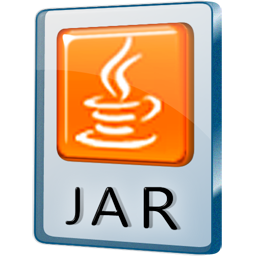



## Download

The current version is **{{ post.title }}**, which was released on <time datetime="{{ post.date | date: "%Y-%m-%d" }}"> {{ post.date | date: "%B %e, %Y" }}</time>.

See the [version history](changelog.html) for a list of changes.

 
**NOTE**: Capstone has been released under the **BSD** license. There is no obligation, except that products using Capstone need to redistribute in the same package file LICENSE.TXT found the source of Capstone.

---

### Git repository 

The latest version of the source code can be retrieved at our [Git repository](https://github.com/aquynh/capstone).

Refer to the [Wiki Changelog](https://github.com/aquynh/capstone/wiki/ChangeLog) of our development branch to peek into the features of the *next release*.

---

### Package repositories       

At the moment Capstone are available for *Mac OSX*, *Ubuntu*, *Debian*, *FreeBSD*, *OpenBSD*, *NetBSD* & *Python* in some package repositories. See [Documentation](documentation.html) for instructions.

---

### Source archive  

<a class="download" href="/download/{{ post.title }}/capstone-{{ post.title }}.tgz" title="Download source (TGZ)">.TGZ</a>

This package contains:

- The complete source code for the Capstone framework.
- Bindings for Java & Python (at the moment, Ocaml binding is only available in the [Git repository](https://github.com/aquynh/capstone)).
- A collection of example and test programs.

This is the recommended version for all platforms.

<a class="download" href="/download/{{ post.title }}/capstone-{{ post.title }}.zip" title="Download source (ZIP)">.ZIP</a>

---

### Community bindings  

Besides Python, Java & Ocaml get supported in the main code, some bindings for other languages are created and maintained by the community.

- [Gapstone](https://github.com/bnagy/gapstone): Go binding (by Ben Nagy).
- [Crabstone](https://github.com/bnagy/crabstone): Ruby binding (by Ben Nagy).
- [Capstone-Vala](https://github.com/radare/capstone-vala): Vala binding (by Pancake).
- [Capstone.NET](https://github.com/9ee1/Capstone.NET): .NET framework binding (by Ahmed Garhy).
- [Node-Capstone](https://github.com/parasyte/node-capstone): NodeJS binding (by Jason Oster).
- [CCcapstone](https://github.com/zer0mem/cccapstone): C++ binding (by Peter Hlavaty).
- [LuaCapstone](https://github.com/Dax89/LuaCapstone): Lua binding (by Antonio Davide).
- [Capstone-RS](https://github.com/richo/capstone-rs): Rust binding (by Richo Healey).
- [C# binding](https://github.com/mattifestation/capstone) (by Matt Graeber) (*Note: this is only for the older version Capstone 2.0*).

---

### Windows - Core engine 

<a class="download" href="/download/{{ post.title }}/capstone-{{ post.title }}-win32.zip" title="Download Win32 Binaries (ZIP)">Win-32</a>

NOTE: This is necessary for all bindings (except Python) & also for C programming.

This package contains:

- README & license file.
- The Capstone header files (\*.h) for C programming.
- 32-bit/64-bit DLLs & static libraries for Microsoft Windows 32-bit/64-bit.
- A test file (test.exe)

<a class="download" href="/download/{{ post.title }}/capstone-{{ post.title }}-win64.zip" title="Download Win64 Binaries (ZIP)">Win-64</a>

---

### Python module for Windows 32 - Binaries  

<a class="download" href="/download/{{ post.title }}/capstone-{{ post.title }}-python2.6-win32.exe" title="Download Python module for Python 2.6, Win32">Python 2.6</a>

NOTE: this installer is self-contain, so you do not need to install the core engine above.

This installer will install 32-bit Capstone module into your corresponding Python edition.

<a class="download" href="/download/{{ post.title }}/capstone-{{ post.title }}-python2.7-win32.exe" title="Download Python module for Python 2.7, Win32">Python 2.7</a>

---

### Python module for Windows 64 - Binaries  

<a class="download" href="/download/{{ post.title }}/capstone-{{ post.title }}-python2.6-win64.exe" title="Download Python module for Python 2.6, Win64">Python 2.6</a>

NOTE: this installer is self-contain, so you do not need to install the core engine above.

This installer will install 64-bit Capstone module into your corresponding Python edition.

<a class="download" href="/download/{{ post.title }}/capstone-{{ post.title }}-python2.7-win64.exe" title="Download Python module for Python 2.7, Win64">Python 2.7</a>

---

### Ubuntu 14.04 - DEB packages 

<a class="download" href="/download/{{ post.title }}/ubuntu-14.04/" title="Download Ubuntu packages for i386 (DEB)">Ubuntu-14.04</a>

This include all the packages for Ubuntu: *libcapstone3*, *libcapstone-dev* & *python-capstone*.

---

### Java package - Binaries 

<a class="download" href="/download/{{ post.title }}/capstone.jar" title="Download Java package (JAR)">JAR</a>

This is the JAR package for Java binding.


